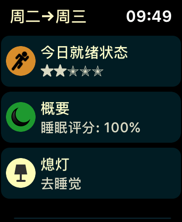
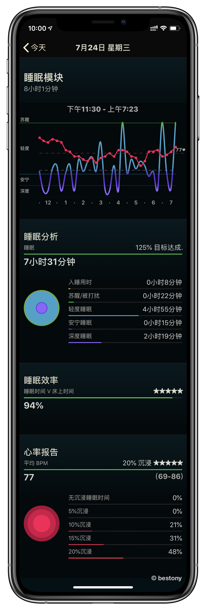
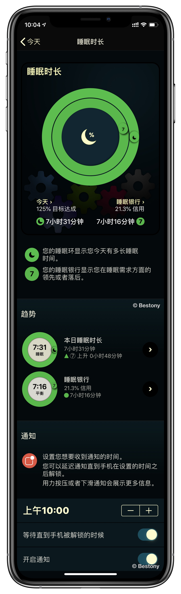
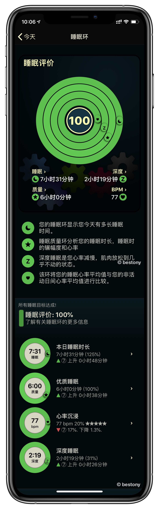
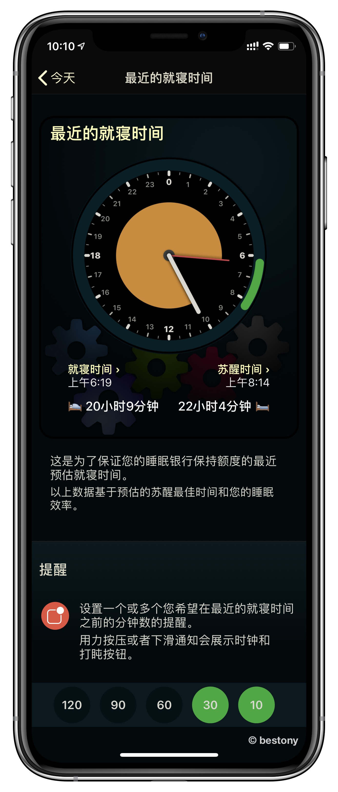
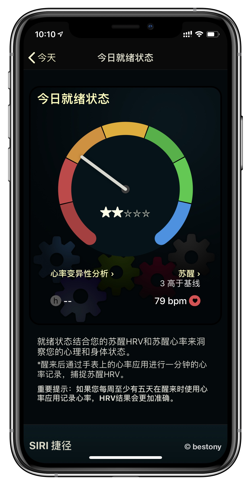
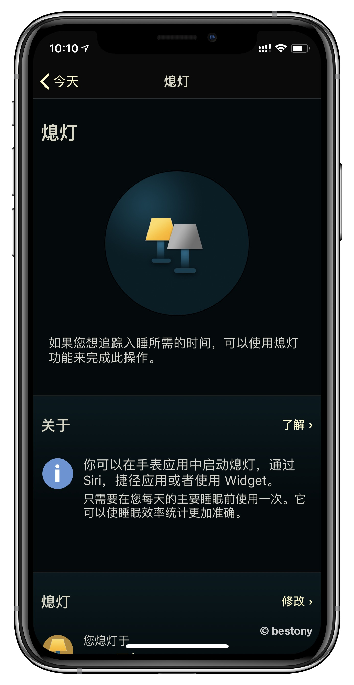

# AutoSleep
> 本文作者：白宦成

AutoSleep 是一款老牌的睡眠检测应用，它主打的是无需任何操作，无需打开任何应用来完成自动的睡眠检测。

## 原理

在 Apple Store 的介绍中，AutoSleep 简要的介绍了一下自己做睡眠检测的原理。

### 睡觉佩戴 Apple Watch 

如果你佩戴了 Apple Watch ，那么你的睡眠检测则是基于你的 Apple Watch 提供的心率、运动情况和位置变化，来判断你的睡眠情况，是否在睡眠。

### 睡觉没有佩戴 Apple Watch 的人

如果你没有佩戴 Apple Watch ，则需要在睡前将手机/手表插上充电，并在醒来以后进行手机解锁，AutoSleep 将只会会记录你的睡眠时长，不做其他的分析。

## 要求

AutoSleep 的使用需要你配合一个运行了 Watch OS 3 及以上版本的 Apple Watch。

## AutoSleep 使用指南
### 普通使用

Auto Sleep 的使用非常简单，你只要戴着手表睡觉就可以了，剩下的都不需要管，AutoSleep 会自己进行数据的采集。

### 入睡时间检测

如果你想要检测自己花了多久的时间睡着的，就需要你佩戴 Apple Watch ，并且睡觉时需要打开 Apple Watch 中的 AutoSleep 应用，点击其中的“熄灯”，然后睡觉， AutoSleep 就会去做你入睡时间的追踪。

### 数据分析

AutoSleep 的数据收集的部分非常简单，我们将重点放在数据的分析上。AutoSleep 的 App 中有多种数据模块，我们一一来看。
#### 今天

在 AutoSleep 中，第一个 Tab 是**今天**，这个模块可以方便我们看到前一天晚上的睡眠情况。其中主要分为 6 个模块：**睡眠模块**、**睡眠时长**、**睡眠评价**、**最近就寝时间**、**今日就绪状态**、**熄灯**

##### 睡眠模块

在睡眠模块中，你可以看到基本的睡眠信息。

**睡眠分析**

睡眠分析部分包含了你最基础的睡眠情况，你入睡用了多久、深度睡眠有多久、轻度睡眠有多久等等一系列信息。

**睡眠效率**

睡眠效率则是你睡眠时间与在床上时间的比值。

**心率报告**

心率报告则会根据你的睡眠情况来分析你睡眠的深度。

##### 睡眠时长

睡眠时长可以看一些自己昨晚的睡眠时长，以及按照你所设定的目标，你睡觉的时间是否满足等信息。

###### 睡眠评价

睡眠评价则是多个指标和历史指标的一个对比，来看出你的睡眠变化趋势。

###### 就寝时间

就寝时间中记录了你最近一次的清醒和睡眠的时间，借助这个数据，你可以看到自己的最近一次的睡眠状态。

##### 就绪状态

就绪状态是记录你在清醒时的心率状态，清醒时心率越高，你的清醒可能波动的越快。

##### 熄灯时间

熄灯时间中记录了你自己睡眠时什么时候标记的熄灯。

## 推荐阅读

- [AutoSleep，苹果生态下完全自动统计睡眠的尝试](https://sspai.com/post/36716)
- [简单几步设置，让 AutoSleep 更准确监测你的睡眠](https://sspai.com/post/42843)
- [更易读的睡眠时钟、更多维度的睡眠指标，这款睡眠监测应用让你更懂自己的睡眠：AutoSleep 6](https://sspai.com/post/51957)
- [AutoSleep | 自动统计睡眠到底靠不靠谱？](https://sspai.com/post/55574)
- [幕后丨众多睡眠检测 App 中，只有他开发的这款能做到「全自动」：专访 AutoSleep](https://sspai.com/post/38854)

## 总结

睡眠是我们一生中最重要的事情之一，如果你懒得去手动记录睡眠时间，那么可以自动记录睡眠时间的 AutoSleep 相信是你的最爱。
