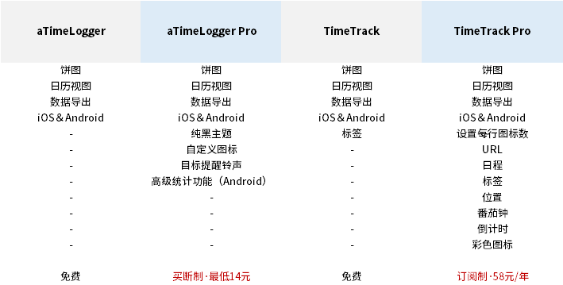
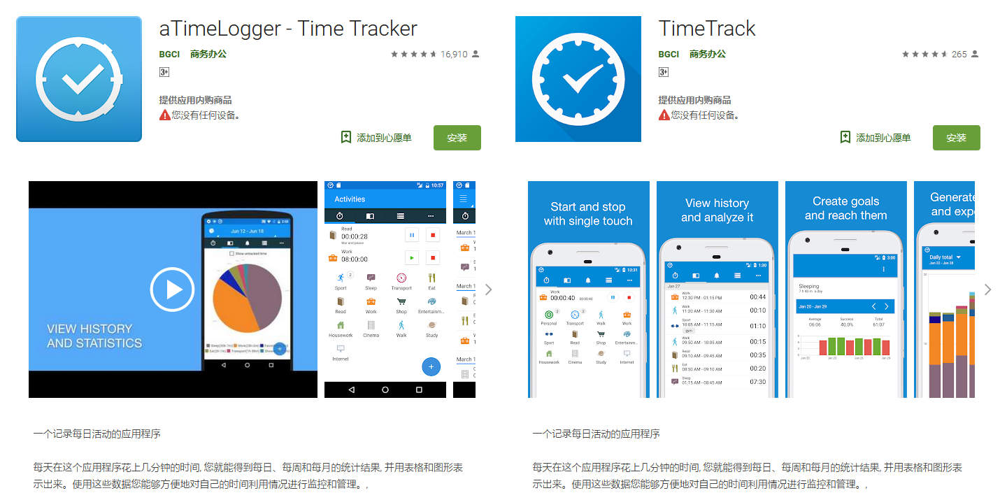
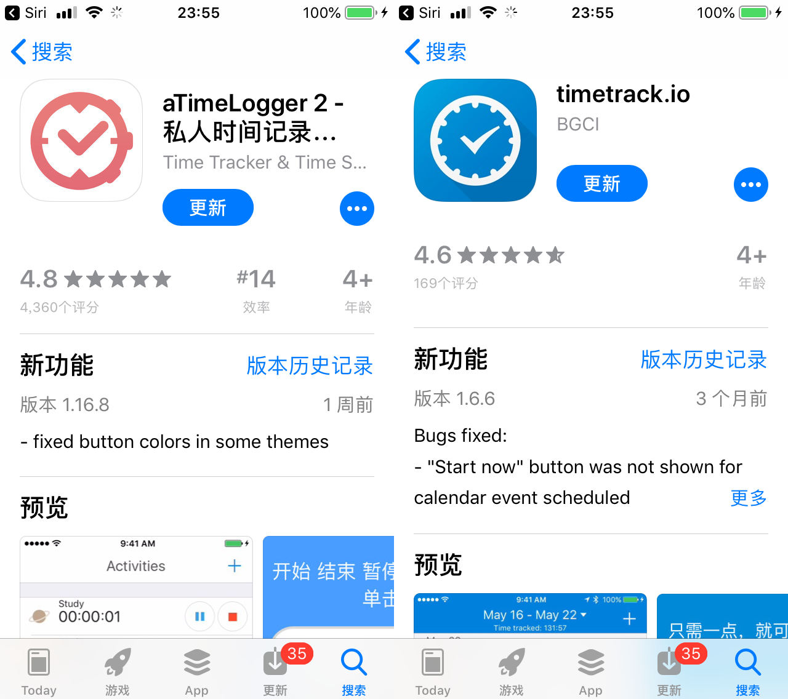
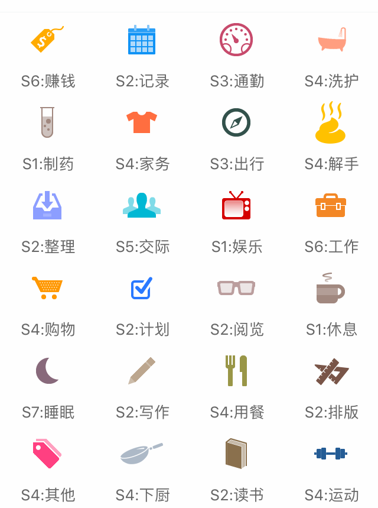
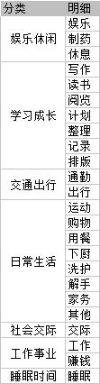
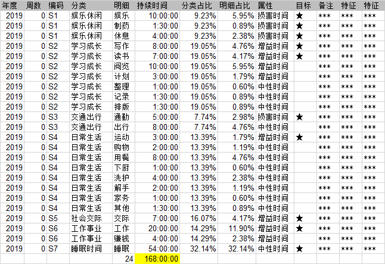
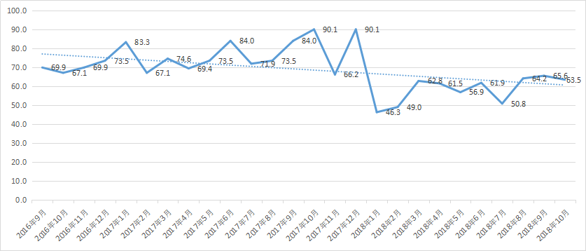
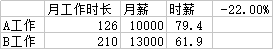
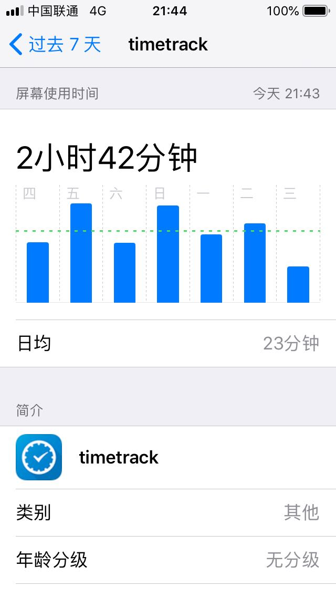

# TimeTrack

> 本文作者：涂俊杰

TimeTrack 是白俄罗斯开发者（@Sergei Zaplitny）开发的一款用于全时间段时间记录的 App，目前提供 iOS 和 Android 版本应用，你可以分别在 App Store 和小米应用商店搜索并下载。

> - TimeTrack官网：http://timetrack.io/
> - aTimeLogger官网：http://www.atimelogger.com/

## TimeTrack 和 aTimeLogger 的区别
两款软件都是 @Sergei Zaplitny 开发，它们的区别如下图：

各位用户根据自己的需求选择不同的软件版本。
我个人建议是，新用户直接使用TimeTrack免费版，在付费之前先测试自己是否习惯这款软件的记录方式，其他的高级图标、番茄钟功能都是锦上添花，习惯之后再付费也不迟。
需要说明的是，有 iOS 用户会发现在App Store中有aTimeLogger和aTimeLogger 2两款软件，但是安卓版本只有aTimeLogger，这里iOS的aTimeLogger2等同于安卓aTimeLogger。

## 为什么使用TimeTrack
我从2016年10月开始24小时全时段时间记录，到现在已经记录了超过20000小时，最早使用aTimeLogger记录，2019年转TimeTrack。
开始时间记录的初衷是受到邹鑫的《小强升职记》和李笑来的《把时间当作朋友》启发，希望提高自己对“时间的知觉”，后来又参考了很多剑飞老师的实操，形成了自己的时间记录体系。
这三年时间，时间记录对我来说最重要的改变是“我能通过历史数据，主动控制时间的流向，达成目标”，最典型的变化是我的娱乐时间从15%降到现在的5%，交际时间从1.5%提高到7%，我每天脑子里都挂着时间目标，提醒自己进度到哪了。
就我的观察，时间记录特别适合这3类人：
1. 想知道自己的时间去哪了，通过记录完成自查
2. 想为世界留下点儿什么，记录自己的人生节点
3. 数据极客，个人量化爱好者，喜欢和数据打交道
如果你想摆脱浑浑噩噩“混时间”，欢迎你加入我们，和时间做朋友。

## TimeTrack的使用方法

### 默认设置
打开TimeTrack，修改TimeTrack的默认设置如下：
1. 更多-设置-开始新活动时-暂停正在进行的活动并开始新活动
2. 打开时间区间冲突提醒
3. 日期格式2019-05-13，时间格式22:31
4. 导出数据格式：yyyy-MM-dd HH:mm:ss
5. 时间开始的第一天设置为“周一”
6. 打开显示秒
7. 最小活动持续时间-不设置
这是我推荐的的默认设置，你可以对应调整。
除了基础设置，我认为你最需要掌握的是“目标”功能。
在“目标”选项卡右上角创建目标，按天或周等周期设置时间用量，设置完成后，当你开始对应活动，目标页面就会发生时间变化，并伴随红黄绿颜色提醒。
每天看一遍，心里对时间用量有数！

### 分类技巧

开始时间记录最麻烦，也最绕不过去的问题就是“如何为时间分类？”
我推荐的把所有时间项分成一，二级两个层级。
其中一级分类<7个，二级分类<30个，太少分不全，太多记不住，数量正好1屏为佳。

建议新手保留一张活动定义表，如图示：

定期复盘当时不知道该如何归类的活动，然后把具体的行动添加到定义表中备忘。

### 远程控制
目前TimeTrack和aTimeLogger都只有移动版本，Web还在开发中。
对于工作时不方便频繁拿手机的人来说，替代方案是使用安卓模拟器。

1. 下载安装网易MuMu模拟器
2. 登录TimeTrack账号，同步数据
3. 重新修改软件默认设置
4. 如果同步错误，重启软件即可

### 数据导出
导出数据的步骤：

1. 更多-报告-[选择时间]-导出报告-CSV-分享
2. 使用WPS打开CSV文件（Excel打开乱码另存编码为ANSI格式）
3. 储存到数据源表并进行分析

../videos/time-timetrack-export.mp4

## 可以分析哪些数据

有了数据之后就需要你发挥想象力，从数据中提取关键信息。
最常见的分析角度是：

* 频次
* 总和
* 比率

然后还需要你发挥一点儿想象力，向自己发问，比如你可以这样问。

### 下班后我在干什么？

选中CSV中的明细数据，创建数据透视表，对活动项的持续时间求和，降序。
筛选出工作日，选择19到凌晨时间段。
如图：

假设你的数据是这样，除了“睡眠”，排名第二的就是“娱乐”，你还好意思说自己下班后还在继续学习，读书写作锻炼自我提高吗？

**诚实记录的好处就是，让你虚假的借口无所遁形，直面恐惧，刺激改变。**

### 我应该换工作吗？

假设现在有两份工作，A工作月薪1万，换工作之后月薪1万3，涨幅30%，该跳槽吗？
抛开环境等其他因素不谈，我们就从“时薪”角度算算这笔账。
在透视表中筛选“工作”，求得每月的持续时间之和，然后新建一列，填上当月薪资，用月薪/当月工作时长，得出“月薪”，选中数据，插入折线图。
如图示：

我们发现从2018年1月换工作后，时薪从85元/h下降到62元/h，负增长22%。

表面上工资涨30%，实际时薪却负增长22%，从时薪角度考虑，这不是个好决定。

### 你距离大师还有多远？

如果我们用“1万小时定律”来衡量技能的熟练度，你的熟练度达到1万小时了吗？

1万小时是什么概念呢？

**每天8小时，坚持3.5年，不中断的做一件事。**

对我来说，我平均每天要花20分钟在TimeTrack的记录上，加上每周20分钟分析，每月1小时分析，每年10小时年报总结。

我坚持了近3年，“大师之路”的进度是500小时，50%，只到一半。
你呢，去看看你的时间记录，哪个活动项达成了“1万小时”成就？

## 总结

如果你注重“精确”，希望全时段记录，而不是分块记录（代表软件“时间块”），那么我强烈推荐你使用TimeTrack。

在时间记录的过程中，一开始你会“意识到时间”，特别是当活动切换到“损害时间”时，点击这个动作就是第一次警示，告诉自己“喂，现在是损害时间，小心点儿花。”

这些留存下的时间记录除了利于你自省之外，还可以积累和传承，随着时间的增加，你会拥有“时间旅行”的能力，迅速“回到”某一天，寻找人生的关键线索。

“时间一旦逝去，就再也找不回来。”

**珍惜时间，这是普通人最应该抓住的翻盘机会。**
